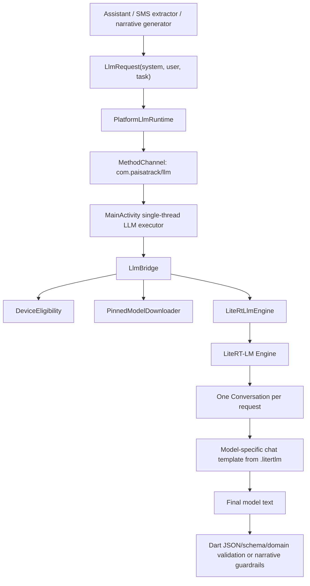

# LiteRT-LM migration and Qwen3 evaluation plan

Status: proposed  
Date: 2026-07-26  
Target: Android only  
Primary runtime candidate: `com.google.ai.edge.litertlm:litertlm-android:0.14.0`  
Primary model candidates:

- `Qwen3-0.6B.litertlm` — dynamic INT8, 4096-token context, about 586 MB.
- `qwen3_0_6b_mixed_int4.litertlm` — mixed INT4, 2048-token context,
  about 474.61 MiB.

This document is an execution plan, not approval to promote either model.
Every production choice remains gated by the device evidence defined below.

## 1. Desired outcome

Replace the maintenance-only MediaPipe LLM Inference runtime with LiteRT-LM
without weakening PaisaTrack's local-only, grounded, deterministic behavior.

The completed feature must:

1. Download exactly one revision-pinned, integrity-checked `.litertlm` artifact
   into app-private storage.
2. Run inference off the Android main thread.
3. Let LiteRT-LM apply the selected model's chat template.
4. Keep assistant answers grounded in deterministic database queries.
5. Keep unmatched-SMS model output behind the existing validation and
   confidence limits.
6. Keep narrative output behind the existing no-digits, length, and
   no-advice rules.
7. Refuse inference before engine initialization on unsupported devices.
8. Close native model state on idle, backgrounding, deletion, model
   replacement, Flutter-engine cleanup, and inference failure.
9. Preserve resumable downloads, exact byte-size verification, SHA-256
   verification, atomic promotion, and deletion.
10. Provide physical-device benchmark evidence before changing the production
    model or supported-device threshold.

## 2. Non-negotiable invariants

Do not change these rules during implementation:

- No prompt, SMS body, transaction, category, aggregate, model output, or
  benchmark fixture containing real financial data may leave the device.
- The only network operation is an explicit model download.
- Never use an unpinned Hugging Face `main` URL in production.
- Never commit a model file to Git or bundle one in the APK.
- Never interpolate raw model prose or model-authored numbers into assistant
  financial answers.
- Never let the model write SQL or select database fields.
- Never allow a probabilistic SMS parse to silently outrank deterministic
  parsing.
- Never treat a catchable allocation exception as protection from Android's
  low-memory killer. A process kill cannot return `LlmUnavailable`.
- Never infer support from model file size. Eligibility must use measured
  runtime memory on the exact artifact/backend/runtime combination.
- Never ship MediaPipe and LiteRT-LM together in the production APK unless a
  separate, explicit packaging review proves that native libraries, APK size,
  startup, and R8 behavior are acceptable.
- Do not add Gemma, NPU execution, a user-facing multi-model picker, cloud
  inference, or free-form assistant answers in this feature.

## 3. Current state and known inconsistencies

### 3.1 Runtime

- `android/app/src/main/kotlin/com/paisatrack/intelligence/LlmBridge.kt`
  uses MediaPipe `tasks-genai:0.10.24`.
- The bridge downloads Qwen2.5-0.5B Q8 as a 546,660,344-byte `.task` file.
- Inference is CPU-only with a 512-token limit and one isolated session per
  request.
- `MainActivity` runs all LLM operations on one scheduled executor and closes
  the cached engine after 60 idle seconds or immediately on backgrounding.

### 3.2 Dart contract

`lib/intelligence/llm/llm_runtime.dart` owns:

- typed success/unavailable results;
- feature, model-absent, unsupported-device, and failure states;
- platform-channel calls;
- JSON extraction and limited schema validation;
- resumable-download retry policy.

Direct consumers are:

- `lib/capture/llm_extractor.dart`;
- `lib/intelligence/assistant/assistant_controller.dart`;
- `lib/intelligence/narrative_insight_generator.dart`;
- `lib/features/settings/settings_screen.dart`;
- `lib/intelligence/nightly_job.dart`;
- `lib/capture/sms_ingestion.dart`;
- `lib/features/assistant/assistant_screen.dart`.

### 3.3 Documentation drift

`docs/decisions/0008-on-device-llm-model.md` pins Qwen2.5-1.5B/1.6 GB, while
the implementation and Settings UI use Qwen2.5-0.5B/547 MB. The migration
must supersede ADR 0008 and eliminate duplicated model metadata.

### 3.4 Missing same-model LiteRT-LM artifact

The current `litert-community/Qwen2.5-0.5B-Instruct` repository exposes
`.task` and `.tflite` artifacts but no published `.litertlm` artifact.
Therefore a "runtime-only, no-model-change" experiment is not available
without creating and validating a new package. Do not hide this variable.
Capture the current MediaPipe baseline first, then compare separate LiteRT-LM
candidate APKs using Qwen3 INT4 and INT8.

## 4. Blast radius and implementation strategy

GitNexus reports:

| Symbol | Risk | Direct dependents | Total affected | Strategy |
|:--|:--|--:|--:|:--|
| Kotlin `LlmBridge` | LOW | 1 | 1 | Replace behind the existing `MainActivity` channel boundary. |
| Dart `LlmRuntime` | HIGH | 16 | 51 | Use additive request APIs and compatibility wrappers first. |
| Dart `PlatformLlmRuntime` | HIGH | 16 | 42 | Preserve existing channel method names and typed failures during migration. |

The Dart contract must be migrated in two passes:

1. Add structured-request methods while keeping the existing raw-string
   methods as wrappers.
2. Migrate every consumer and fake, then remove raw chat-template placeholders
   only after all tests pass.

Why: changing the abstract method signatures in one edit forces unrelated
assistant, settings, capture, nightly, widget, and integration tests to fail
at once.

## 5. Target architecture



Recommended native file split:

```text
android/app/src/main/kotlin/com/paisatrack/intelligence/
  LlmBridge.kt
  LlmModelSpec.kt
  PinnedModelDownloader.kt
  DeviceEligibility.kt
  LiteRtLlmEngine.kt
```

Recommended Dart file split:

```text
lib/intelligence/llm/
  llm_request.dart
  llm_model_status.dart
  llm_runtime.dart
```

Do not create a general framework. These types exist only to make model
metadata, prompting, runtime lifecycle, and platform payloads explicit.

## 6. Execution order

Complete tasks in the listed order. Do not start a later phase while an
earlier phase has failing acceptance criteria.

---

## Phase 0 — Freeze the baseline and decisions

### P0.1 Create ADR 0009

Add `docs/decisions/0009-litert-lm-runtime-and-qwen3-evaluation.md`.

The ADR must:

1. State that it supersedes the runtime/model portions of ADR 0008.
2. Record the code/ADR mismatch found during planning.
3. Record MediaPipe maintenance-only status.
4. Pin LiteRT-LM Android `0.14.0` for the experiment.
5. Record that Java/Kotlin 17 is the current project target.
6. Say Java 21 is not assumed; the compatibility spike decides whether a
   toolchain change is required.
7. Name both Qwen3 candidates and their distinct context lengths.
8. Record Apache-2.0 licensing and ungated-download requirements.
9. State that no candidate is production-approved until Phase 8 passes.
10. State that the prior APK/commit is the rollback mechanism; both native
    runtimes will not be shipped together by default.

Acceptance criteria:

- ADR 0008 links to ADR 0009 as the superseding decision.
- `docs/architecture.md` does not claim a model that disagrees with code.
- No model quality, minimum-RAM, or speed claim lacks a cited benchmark.

### P0.2 Capture the current MediaPipe baseline

Use the current application and downloaded Qwen2.5-0.5B model before modifying
the runtime.

Record:

- device manufacturer/model, Android version, SoC if known, physical RAM;
- APK commit SHA and build mode;
- runtime/model name, exact pinned revision, file size, and SHA-256;
- cold engine initialization time;
- warm TTFT and complete-response latency;
- process total PSS before load, after load, during inference, and after close;
- 20 repeated assistant fallback requests;
- the SMS benchmark corpus;
- the narrative policy corpus;
- crashes, ANRs, LMK events, and thermal throttling.

Store sanitized results under:

```text
docs/benchmarks/llm/mediapipe-qwen2_5-0_5b/<yyyy-mm-dd>/
  environment.md
  assistant-results.json
  sms-results.json
  narrative-results.json
  memory.csv
  latency.csv
```

Do not store prompts containing real user data.

Acceptance criteria:

- At least one 4 GB device and one 8 GB device are measured.
- A 3 GB device is included if PaisaTrack intends to retain that tier.
- Every candidate result later uses the same sanitized corpus and devices.

### P0.3 Pin candidate artifact manifests

For each candidate, obtain metadata from the Hugging Face API/model tree and
write it into ADR 0009 before downloader implementation.

Required fields:

```text
id
displayName
repository
revisionCommit
fileName
downloadUrl
sizeBytes
sha256
quantization
contextTokens
license
licenseUrl
allowedBackends
```

Rules:

- `downloadUrl` must contain `revisionCommit`.
- `sha256` must match the Hugging Face LFS object identifier or a locally
  verified full download.
- `sizeBytes` must be an exact integer, not "MB".
- INT4 and INT8 are separate specs; never reuse filename, hash, context, or
  memory data between them.
- Leave `minimumTotalMemoryBytes` unset until Phase 8.

Acceptance criteria:

- A reviewer can reproduce every manifest field from the cited primary source.
- The manifest contains no `main`, `latest`, approximate byte count, or
  placeholder hash.

---

## Phase 1 — Prove build compatibility

This is a throwaway compatibility spike. Do not rewrite `LlmBridge` yet.

### P1.1 Add the Android dependency

In `android/app/build.gradle.kts`:

```kotlin
implementation("com.google.ai.edge.litertlm:litertlm-android:0.14.0")
```

Temporarily keep `tasks-genai:0.10.24` only for the compatibility spike.

In `android/app/src/main/AndroidManifest.xml`, inside `<application>`, add:

```xml
<uses-native-library
    android:name="libvndksupport.so"
    android:required="false" />
<uses-native-library
    android:name="libOpenCL.so"
    android:required="false" />
```

Do not change Java/Kotlin 17 pre-emptively.

### P1.2 Add a compile-only smoke class

Add a temporary test-only or debug-only Kotlin class that imports:

```kotlin
Backend
ConversationConfig
Contents
Engine
EngineConfig
SamplerConfig
```

It must compile an `EngineConfig` for `Backend.CPU()` but must not initialize
an engine or require a model.

### P1.3 Verify packaging

Run:

```sh
cd android
rtk proxy ./gradlew :app:testDebugUnitTest
rtk proxy ./gradlew :app:assembleDebug
rtk proxy ./gradlew :app:assembleRelease
```

Inspect the release build for:

- duplicate native libraries;
- R8 missing-class warnings;
- Java class-version errors;
- minSdk/ABI errors;
- unexpected APK-size growth;
- startup crashes on one physical Android device.

Decision:

- If Java/Kotlin 17 builds cleanly, keep 17.
- If the build fails with a confirmed Java class-version requirement, update
  the toolchain in a separate commit and document the exact error and source
  requirement in ADR 0009.
- If MediaPipe and LiteRT-LM cannot coexist cleanly, remove MediaPipe before
  continuing and use separate baseline/candidate APKs. Do not work around
  native conflicts with broad `pickFirst` rules.

Acceptance criteria:

- Debug and release APKs build.
- The existing Android unit tests pass.
- No unexplained R8 or duplicate-native-library warning remains.
- The compatibility result is recorded in ADR 0009.

Commit checkpoint: dependency/manifest compatibility only.

---

## Phase 2 — Introduce structured prompts additively

### P2.1 Add `LlmRequest`

Create `lib/intelligence/llm/llm_request.dart`:

```dart
enum LlmTask {
  jsonExtraction,
  assistantIntent,
  narrative,
}

class LlmRequest {
  const LlmRequest({
    required this.systemInstruction,
    required this.userMessage,
    required this.task,
  });

  final String systemInstruction;
  final String userMessage;
  final LlmTask task;
}
```

Validation rules in Dart:

- `systemInstruction.trim()` and `userMessage.trim()` must be non-empty.
- Assistant user text remains capped at 500 characters.
- Do not put raw chat-template tokens in either field.
- Do not put a model identifier in prompts.

### P2.2 Add compatibility methods to `LlmRuntime`

Add these methods without deleting existing methods:

```dart
Future<LlmResult<String>> completeRequest(LlmRequest request);

Future<LlmResult<Map<String, Object?>>> extractJsonRequest(
  LlmRequest request,
  Map<String, Object?> schema,
);
```

During Phase 2, keep the existing implementations of:

```dart
complete(String prompt)
extractJson(String prompt, Map<String, Object?> schema)
```

unchanged. Existing production consumers must continue to use them until the
native channel accepts structured requests in Phase 6. No Phase 2 code may
route a production call through a channel payload that the current
`MainActivity` does not understand.

Implement the new methods in `PlatformLlmRuntime` so their channel payload can
be asserted with a mock `MethodChannel`; do not call them from production
consumers yet. Add matching unavailable implementations to `NoopLlmRuntime`
and update any fake that directly implements the abstract class.

After Phase 6 lands and every consumer is migrated in Phase 7, invert the
compatibility direction:

- `complete(String prompt)` becomes a wrapper around `completeRequest` with
  system instruction `"Follow the user's instruction."`, the supplied prompt
  as `userMessage`, and task `narrative`.
- `extractJson(String prompt, schema)` becomes a wrapper around
  `extractJsonRequest` with system instruction
  `"Extract the requested data and return only schema-valid JSON."`, the
  supplied prompt as `userMessage`, and task `jsonExtraction`.

Remove these wrappers only after a second GitNexus impact review proves no
caller or test still depends on them.

### P2.3 Define the JSON request contract

`extractJsonRequest` must:

1. JSON-encode the schema in Dart.
2. Append the schema to the system instruction, not the user data.
3. Call `completeRequest`.
4. Extract only the final-answer text.
5. Reject a non-empty `<think>...</think>` block for structured tasks.
6. Permit and remove one empty leading `<think></think>` block because Qwen3
   may emit it when `/no_think` is used.
7. Parse a JSON object.
8. Apply the existing strict schema checks.
9. Return `LlmUnavailable(failure)` for malformed or invalid output.

Do not log the response text or prompt on failure.

### P2.4 Add unit tests before migrating consumers

Extend `test/intelligence/llm/llm_runtime_test.dart` with:

- structured payload sends `systemInstruction`, `userMessage`, and `task`;
- empty system/user input fails without a platform call;
- schema is placed in the system instruction;
- valid fenced/prose JSON behavior remains defined;
- an empty leading `<think></think>` block is ignored;
- non-empty thinking content fails structured extraction;
- `/think` in user text is not confused with output markers;
- existing platform exception mappings remain unchanged;
- compatibility wrappers still work.

Acceptance criteria:

- Existing tests remain green.
- No consumer is migrated in this task.
- The platform payload shape is fully asserted in unit tests.

Commit checkpoint: additive Dart request contract.

---

## Phase 3 — Implement secure model management

Complete model management before initializing LiteRT-LM.

### P3.1 Add `LlmModelSpec`

Create `LlmModelSpec.kt` as an immutable data class with:

```text
id
displayName
runtime
repository
revision
fileName
downloadUrl
sizeBytes
sha256
quantization
contextTokens
allowedBackends
```

Add one registry object containing exactly the two Phase 8 candidates.
Choose the active candidate through a debug/test build constant during
benchmarking. Production must expose only the model that passes Phase 8.

Do not copy display name or byte size into Dart constants. `LlmBridge` will
return the active spec as platform-channel model status.

### P3.2 Extract `PinnedModelDownloader`

Move download/install responsibilities out of `LlmBridge.kt`.

Constructor dependencies must be injectable:

```text
models directory
active LlmModelSpec
HTTP connection factory
free-space provider
beforePromote callback
progress callback
cancel signal
```

Required behavior:

1. Use `<fileName>.part` for a partial download.
2. Reject a partial file larger than `sizeBytes`.
3. Reject a non-HTTPS final URL.
4. Before reading a body, accept only:
   - `206` when resuming with a valid matching `Content-Range`;
   - `200` for a fresh download or a server that ignored Range, after deleting
     the stale partial.
5. Reject other response codes without reading `inputStream`.
6. Reject `Content-Length` larger than the expected remaining bytes.
7. Copy through a bounded loop; stop once one byte beyond the expected size
   is observed.
8. Preserve an in-range partial file after interruption/cancellation.
9. Verify exact size and SHA-256 before promotion.
10. Close the active engine before replacing the target.
11. Promote with atomic rename when possible; otherwise copy, reverify, and
    delete the partial.
12. Never delete another model's file or partial.
13. Require free app-storage space of at least:
    `remainingDownloadBytes + sizeBytes + 128 MiB`.
    This allows a non-atomic fallback copy plus headroom.

Why: the current downloader can consume an unbounded response before detecting
the wrong final size.

### P3.3 Add downloader unit tests

Replace network access with a fake `HttpURLConnection`.

Required cases:

- already-installed valid model returns success without opening a connection;
- fresh `200` download succeeds;
- matching `206` resume succeeds;
- ignored Range with `200` restarts from byte zero;
- mismatched `Content-Range` fails safely;
- `404`, `416`, and `500` fail without reading the body;
- oversized `Content-Length` fails before copy;
- a chunked body exceeding expected bytes aborts;
- truncated body leaves an in-range partial;
- wrong SHA deletes the complete corrupt partial;
- valid complete partial promotes without network;
- cancellation retains an in-range partial;
- insufficient storage prevents network access;
- replacement closes the engine before promotion;
- delete removes target and partial and is idempotent.

Acceptance criteria:

- Tests make no real network request.
- No exception message contains URL query data, prompt text, or SMS text.
- Installer behavior is deterministic and independent of LiteRT-LM.

Commit checkpoint: model spec and secure downloader.

---

## Phase 4 — Implement device eligibility

Create `DeviceEligibility.kt`.

### P4.1 Define a typed eligibility result

Native result fields:

```text
supported
reason
totalMemoryBytes
availableMemoryBytes
lowRamDevice
requiredStorageBytes
availableStorageBytes
candidateBackend
modelId
```

Allowed `reason` values:

```text
supported
benchmark_not_approved
low_ram_device
insufficient_total_memory
insufficient_available_memory
insufficient_storage
backend_unavailable
model_absent
initialization_failed
```

Do not return raw exception text to Dart.

### P4.2 Separate download eligibility from inference eligibility

Download eligibility:

- artifact is production-approved or the build is a benchmark build;
- enough app-private storage exists;
- device is not an Android low-RAM device;
- device belongs to a RAM tier included in the current experiment.

Inference eligibility:

- download eligibility passed;
- model is installed and verified;
- measured RAM threshold for the exact model/backend is satisfied;
- available-memory safety margin is satisfied;
- backend initialization probe has not previously failed for this app run.

Until Phase 8 approves a threshold:

- production builds report `benchmark_not_approved`;
- benchmark builds may proceed only after explicit tester action;
- Settings must not claim a general minimum-RAM requirement.

### P4.3 Memory safety rule

After benchmarking, calculate:

```text
requiredAvailableMemory =
  measuredPeakIncrementalPss
  + steadyStateAppPss
  + max(512 MiB, 25% of measuredPeakIncrementalPss)
```

Round the resulting supported total-RAM tier upward. Do not lower the tier
because one device happened to survive one run.

Do not catch `OutOfMemoryError` and continue. Avoid starting inference when
the safety rule fails.

### P4.4 Tests

Unit-test:

- low-RAM device;
- insufficient total memory;
- sufficient total but insufficient available memory;
- insufficient storage;
- unapproved model in production;
- approved benchmark model;
- failed backend probe;
- typed result serialization.

Commit checkpoint: eligibility only.

---

## Phase 5 — Implement the LiteRT-LM engine

Create `LiteRtLlmEngine.kt`.

### P5.1 Engine lifecycle

Use the official API shape:

```kotlin
val config = EngineConfig(
    modelPath = modelPath,
    backend = backend,
    cacheDir = context.cacheDir.path,
)
val engine = Engine(config)
engine.initialize()
```

Rules:

- Call `initialize()` only on `MainActivity`'s LLM executor.
- Never initialize on the Android main thread.
- Cache at most one `Engine`.
- Cache identity is `(modelId, backend)`.
- Close and replace the engine when identity changes.
- Close after the existing 60-second idle timeout.
- Close on backgrounding, model deletion/replacement, Flutter cleanup, and
  inference error.
- `close()` must be idempotent.

### P5.2 One isolated conversation per request

For each request:

1. Create `ConversationConfig` with `Contents.of(systemInstruction)`.
2. Select a named sampler profile based on `LlmTask`.
3. Create one conversation.
4. Send one user message synchronously on the LLM executor.
5. Read only the returned model text.
6. Close the conversation in `use`.

Do not reuse conversation history between requests.

### P5.3 Thinking control

Qwen3 defaults to thinking in its upstream chat template.

For `jsonExtraction` and `assistantIntent`:

- append a final `"/no_think"` instruction to the native user message;
- never add raw `<|im_start|>` tokens;
- treat `<think>...</think>` as output markup, not an input switch;
- return the raw final text to Dart so the tested Dart normalization policy is
  applied consistently.

For `narrative`:

- also start in non-thinking mode for latency and output-policy simplicity;
- do not expose any thinking block to the UI.

### P5.4 Sampler profiles

Define named profiles in one native object:

```text
structuredDeterministic
narrativeConservative
```

Do not finalize values from intuition. Benchmark at least:

- deterministic: `topK=1`, `topP=1.0`, `temperature=0.0`;
- Qwen3 non-thinking recommendation: `topK=20`, `topP=0.8`,
  `temperature=0.7`.

ADR 0009 must record the winning profile per task before production.
Never enable experimental MTP/speculative decoding in the first production
release.

### P5.5 Backend policy

Initial production scope is CPU and GPU only.

Benchmark both when the artifact supports them:

1. Try the benchmark-selected backend.
2. If initialization throws a documented LiteRT-LM initialization exception,
   close partial engine state and return `backend_unavailable`.
3. Do not silently fall back to a different backend in benchmark builds;
   separate results by backend.
4. Production may use a documented fallback only after both paths pass the
   full corpus.
5. Do not implement NPU in this feature.

### P5.6 Native unit tests

Wrap LiteRT-LM behind an internal handle/factory interface so JVM tests do not
load native libraries.

Test:

- engine created once for repeated requests;
- one conversation per request;
- conversation always closes;
- engine closes exactly once;
- engine identity change forces close/recreate;
- `/no_think` added only once;
- system and user text remain separate;
- failure closes poisoned engine;
- close/delete/background calls are idempotent;
- no conversation history crosses requests.

Acceptance criteria:

- Tests require no model and no device.
- Native API objects are isolated behind injectable factories.
- No prompt text is logged.

Commit checkpoint: LiteRT engine with fake-backed unit tests.

---

## Phase 6 — Wire the platform channel

### P6.1 Preserve method names

Keep:

```text
isModelAvailable
isDeviceSupported
downloadModel
deleteModel
complete
```

Add:

```text
modelStatus
cancelModelDownload
```

Change `complete` arguments from:

```json
{"prompt": "..."}
```

to:

```json
{
  "systemInstruction": "...",
  "userMessage": "...",
  "task": "assistantIntent"
}
```

During the additive migration, accept the old `prompt` key only for tests and
unmigrated callers. Remove it after Phase 7.

### P6.2 Validate arguments in `MainActivity`

Before scheduling native work:

- both text fields must be strings and non-blank;
- task must map to a known enum;
- reject unknown keys/tasks with `invalid_arguments`;
- never include supplied text in the error message.

### P6.3 Error mapping

Native error codes:

```text
feature_disabled
model_absent
unsupported_device
backend_unavailable
initialization_failure
inference_failure
download_failure
download_cancelled
insufficient_storage
```

Dart may initially fold new runtime failures into the existing
`LlmUnavailableReason.failure`, but Settings must receive the detailed typed
model status. Do not expose native exception messages to users.

### P6.4 Download progress

Add `EventChannel("com.paisatrack/llm_download")`.

Payload:

```json
{
  "modelId": "qwen3-0.6b-int4",
  "state": "downloading",
  "downloadedBytes": 123,
  "totalBytes": 456
}
```

Allowed states:

```text
idle
downloading
verifying
installed
cancelled
failed
```

Throttle events to at most four per second and always send the terminal state.
Do not include URLs.

### P6.5 Channel tests

Test:

- old and new payload handling during migration;
- missing/blank fields;
- unknown task;
- every native error mapping;
- progress serialization;
- calls run on the LLM executor;
- Flutter results return on the main thread;
- cleanup closes the engine and progress stream.

Commit checkpoint: platform integration.

---

## Phase 7 — Migrate every Dart consumer

Migrate one consumer at a time. Run its focused tests before moving on.

### P7.1 Assistant intent fallback

Modify `lib/intelligence/assistant/assistant_controller.dart`.

System instruction must contain:

- classifier role;
- compact field contract;
- current date;
- valid category names;
- examples;
- JSON-only instruction.

User message must contain only the user's normalized question.

Remove all `<|im_start|>`, `<|im_end|>`, and assistant-prefill tokens.

Keep unchanged:

- deterministic classifier runs first;
- 500-character limit;
- LRU intent cache;
- `IntentValidator`;
- deterministic query engine;
- deterministic answer renderer;
- refusal messages.

Tests:

- request roles contain the correct data;
- no raw template tokens remain;
- common questions still avoid LLM calls;
- fallback output still passes `IntentValidator`;
- malformed/unsupported output refuses safely;
- no model prose reaches `AnswerRenderer`.

### P7.2 SMS extraction

Modify `lib/capture/llm_extractor.dart`.

System instruction contains:

- extraction role;
- "one completed financial transaction";
- omit unknowns/never guess;
- exact schema.

User message contains only the sanitized/raw SMS body provided by the existing
capture pipeline.

Keep unchanged:

- amount must be finite and positive;
- confidence range;
- timestamp bounds;
- direction/channel enum mapping;
- optional text trimming;
- `ParseSource.localLlm`;
- confidence capped at `0.75`.

Tests:

- roles are separated;
- every domain validation remains active;
- schema-valid but semantically invalid values are rejected;
- deterministic parser continues to precede LLM fallback;
- no SMS content appears in exceptions/logs.

### P7.3 Narrative insights

Modify `lib/intelligence/narrative_insight_generator.dart`.

System instruction contains:

- one short neutral observation;
- no advice;
- no digits or currency amounts;
- use only supplied aggregates.

User message contains only aggregate JSON. Never include transaction rows or
raw SMS.

Keep unchanged:

- disabled behavior deletes stale narrative;
- no generation when aggregates are empty;
- output length limit;
- digit rejection;
- deterministic insight payloads remain the source.

Add rejection tests for:

- advice language from a fixed denylist/rubric;
- digits in Unicode and ASCII forms;
- empty/oversized output;
- thinking markup;
- invented JSON fields if a structured narrative contract is later used.

### P7.4 Remove compatibility placeholders

After all consumers and fakes use `LlmRequest`:

- remove `llmJsonSchemaPlaceholder`;
- remove `llmJsonValidationOnlyPlaceholder`;
- remove raw-template handling;
- remove old `prompt` platform payload support;
- keep `complete(String)` only if an external test still needs it; otherwise
  remove it in a separate, impact-reviewed change.

Run GitNexus impact analysis again before removing any abstract method.

Acceptance criteria:

- Repository search finds no `<|im_start|>`, `<|im_end|>`,
  `{{JSON_SCHEMA}}`, or `{{VALIDATE_JSON_ONLY}}` outside historical docs.
- All consumer unit tests pass.

Commit checkpoints: assistant, SMS, and narrative migrations separately.

---

## Phase 8 — Settings and user experience

### P8.1 Add typed Dart model status

Create `lib/intelligence/llm/llm_model_status.dart`.

Fields:

```text
modelId
displayName
sizeBytes
runtime
quantization
contextTokens
installed
supported
supportReason
backend
downloadState
downloadedBytes
```

Parse defensively. Unknown enum strings map to an `unknown` state, not a crash.

### P8.2 Update `_LlmModelTile`

Replace hardcoded:

```text
Qwen2.5 0.5B · 547 MB
requires at least 3 GB RAM
```

with native model status.

UI requirements:

- show exact selected model display name and human-readable download size;
- show runtime and selected backend after installation;
- show download percentage and verification state;
- allow cancellation while downloading;
- explain that cancellation preserves resumable progress;
- show typed unsupported reason without raw exception details;
- keep delete control;
- confirm deletion when a model is installed;
- after deletion, refresh status and ensure the engine is closed;
- never advertise a RAM threshold until benchmark approval records it.

Do not expose INT4/INT8 selection in production Settings. Benchmark builds may
show the active artifact in Developer options.

### P8.3 Settings tests

Extend `test/features/settings/settings_test.dart`:

- status loading;
- supported/not installed;
- download progress;
- cancellation;
- verification;
- installed;
- typed unsupported reasons;
- failed download and retry;
- delete confirmation and success;
- delete failure;
- no hardcoded stale model name/size;
- no raw native error text.

Acceptance criteria:

- Long model names and large text scale do not overflow.
- Screen-reader labels include progress and action.
- Download state survives widget rebuilds through the provider/channel stream.

Commit checkpoint: status and Settings UX.

---

## Phase 9 — Build the benchmark harness

The harness must measure semantics, not just valid JSON.

### P9.1 Fixture layout

Add only sanitized synthetic fixtures:

```text
integration_test/fixtures/llm/
  assistant_intents.json
  sms_extraction.json
  narrative_policy.json
```

Assistant fixture fields:

```text
id
question
today
categories
expectedExpandedIntent
```

Use questions that the deterministic classifier intentionally does not resolve;
otherwise the model is not tested.

SMS fixture fields:

```text
id
sms
receivedAt
expected
criticalFields
```

Narrative fixture fields:

```text
id
aggregates
mustNotContain
maxLength
```

### P9.2 Metrics

Record separately:

#### Structured-output mechanics

- JSON parse rate;
- schema-valid rate;
- empty/non-empty thinking-block rate;
- extra-field rate.

#### Assistant semantics

- whole expanded-intent exact match;
- per-field accuracy;
- refusal accuracy;
- repeated-run consistency.

#### SMS semantics

- whole-object exact match;
- amount accuracy;
- direction accuracy;
- channel accuracy;
- timestamp accuracy/tolerance;
- optional-field precision and recall;
- false-positive transaction rate.

#### Narrative policy

- generation success rate;
- digit/currency violation rate;
- advice violation rate;
- unsupported factual claim rate from human review;
- length violation rate.

#### Runtime

- cold engine initialization;
- TTFT;
- total response latency;
- decode tokens/second when available;
- process total PSS;
- Java/native/graphics memory breakdown;
- post-close memory;
- crash, ANR, and LMK count;
- battery and thermal state before/after sustained runs.

### P9.3 Repetition

Run every structured case:

- three times for deterministic sampler;
- five times for sampled profiles;
- once cold and at least twice warm for latency;
- 50 consecutive mixed requests for lifecycle stability.

Do not average away failures. Report counts and p50/p95 latency.

### P9.4 Device matrix

Minimum matrix:

| Tier | Required evidence |
|:--|:--|
| 3 GB | At least one device if continued support is claimed. |
| 4 GB | At least two devices from different vendors/SoCs. |
| 6 GB | At least one device. |
| 8 GB+ | At least one device. |

For each model, run CPU. Run GPU only where initialization succeeds and record
OpenCL/vendor details. Do not merge CPU and GPU results.

### P9.5 Commands

Baseline/candidate device test:

```sh
rtk proxy .tooling/flutter/bin/flutter run --debug -d <device-id> \
  -t integration_test/llm_reliability_test.dart
```

Memory snapshots:

```sh
rtk proxy adb shell dumpsys meminfo com.paisatrack
rtk proxy adb shell dumpsys activity processes | rtk proxy grep com.paisatrack
rtk proxy adb logcat -d | \
  rtk proxy grep -E "lowmemorykiller|lmkd|OutOfMemory|ANR|paisatrack"
```

Capture timestamps before/after each run so log evidence is bounded.

### P9.6 Promotion gates

A candidate/backend/sampler combination passes only when:

1. No crash, ANR, or LMK event occurs in 50 consecutive mixed requests.
2. JSON parse and schema-valid rates are not below the MediaPipe baseline.
3. Assistant whole-intent accuracy is not below baseline.
4. SMS amount, direction, timestamp, and false-positive rates do not regress.
5. Narrative policy violations are zero.
6. Non-empty thinking blocks are zero for structured tasks.
7. p95 latency is no more than 20% slower than baseline on the same device.
8. Post-close memory returns to within 15% of the pre-load baseline.
9. The memory safety formula in Phase 4 passes for the claimed RAM tier.
10. Download, resume, verification, cancellation, replacement, and deletion
    pass on a physical device.

If INT4 and INT8 both pass, choose using this order:

1. semantic accuracy;
2. supported-device coverage;
3. crash/LMK safety;
4. p95 latency;
5. download/storage size.

Do not choose by parameter count or model-card benchmark alone.

Commit checkpoint: fixtures, harness, and evidence only.

---

## Phase 10 — Production decision and rollout

### P10.1 Record the winner

Update ADR 0009 with:

- winning artifact manifest;
- runtime version;
- backend and fallback policy;
- sampler profile per task;
- measured supported RAM tiers;
- failed tiers and reasons;
- benchmark evidence links;
- final download/storage copy;
- rollback commit/version.

Delete the losing candidate from the production registry. Benchmark metadata
may remain in documentation.

### P10.2 Remove MediaPipe LLM runtime

Only after the winner passes:

1. Remove `com.google.mediapipe:tasks-genai:0.10.24`.
2. Keep `tasks-text:0.10.26`; it serves the embedder and is out of scope.
3. Remove MediaPipe LLM imports and dead bridge types.
4. Preserve installer tests under the new downloader names.
5. Verify release R8 and native packaging again.

### P10.3 Rollout stages

1. Internal benchmark APK.
2. Dogfood build with model download visible only in Developer options.
3. Small production release with existing deterministic paths unchanged.
4. Monitor only local, non-sensitive counters:
   - initialization success/failure count;
   - typed failure reason count;
   - inference duration buckets;
   - model deletion/download state.

Do not collect prompts, outputs, SMS content, transaction data, or identifiers.
If no privacy-safe telemetry system exists, inspect device-local debug metrics
only; do not add a cloud service for this feature.

### P10.4 Rollback triggers

Rollback to the prior release/commit when any occurs:

- repeatable crash, ANR, or LMK on an approved device;
- corrupted download cannot self-recover through delete/redownload;
- assistant grounding invariant is violated;
- SMS false-positive rate regresses;
- narrative emits digits/advice after validation;
- release-only R8/native failure;
- model license or artifact disappears/changes unexpectedly.

Rollback actions:

1. Disable model download in the next build.
2. Restore the previous runtime commit/release.
3. Preserve user database and deterministic paths.
4. Delete or ignore incompatible `.litertlm` files by model ID; never interpret
   them as the old `.task` model.
5. Document the failure in ADR 0009 before retrying.

---

## 7. Complete file checklist

Expected additions:

```text
docs/decisions/0009-litert-lm-runtime-and-qwen3-evaluation.md
docs/litert-lm-migration-plan.md
lib/intelligence/llm/llm_request.dart
lib/intelligence/llm/llm_model_status.dart
android/app/src/main/kotlin/com/paisatrack/intelligence/LlmModelSpec.kt
android/app/src/main/kotlin/com/paisatrack/intelligence/PinnedModelDownloader.kt
android/app/src/main/kotlin/com/paisatrack/intelligence/DeviceEligibility.kt
android/app/src/main/kotlin/com/paisatrack/intelligence/LiteRtLlmEngine.kt
integration_test/fixtures/llm/assistant_intents.json
integration_test/fixtures/llm/sms_extraction.json
integration_test/fixtures/llm/narrative_policy.json
```

Expected modifications:

```text
android/app/build.gradle.kts
android/app/src/main/AndroidManifest.xml
android/app/src/main/kotlin/com/paisatrack/MainActivity.kt
android/app/src/main/kotlin/com/paisatrack/intelligence/LlmBridge.kt
android/app/src/test/kotlin/com/paisatrack/intelligence/LlmBridgeTest.kt
lib/intelligence/llm/llm_runtime.dart
lib/intelligence/assistant/assistant_controller.dart
lib/capture/llm_extractor.dart
lib/intelligence/narrative_insight_generator.dart
lib/features/settings/settings_screen.dart
integration_test/llm_reliability_test.dart
test/intelligence/llm/llm_runtime_test.dart
test/intelligence/assistant/assistant_controller_test.dart
test/intelligence/assistant/assistant_compact_intent_test.dart
test/capture/llm_extractor_test.dart
test/intelligence/narrative_insight_generator_test.dart
test/features/settings/settings_test.dart
docs/architecture.md
docs/assistant-nlq.md
docs/privacy.md
docs/development.md
docs/decisions/0008-on-device-llm-model.md
```

Files explicitly out of scope:

```text
lib/data/db/*
lib/intelligence/assistant/query_engine.dart
lib/intelligence/assistant/answer_renderer.dart
android/app/src/main/kotlin/com/paisatrack/intelligence/EmbedderBridge.kt
packages/paisatrack_keystore/*
```

If implementation requires changing an out-of-scope file, stop and explain why
before editing it.

## 8. Verification matrix

Run focused tests after each task, then the full suite.

### Dart

```sh
rtk proxy .tooling/flutter/bin/dart format \
  lib/intelligence/llm \
  lib/intelligence/assistant/assistant_controller.dart \
  lib/capture/llm_extractor.dart \
  lib/intelligence/narrative_insight_generator.dart \
  lib/features/settings/settings_screen.dart \
  test/intelligence/llm \
  test/intelligence/assistant \
  test/capture/llm_extractor_test.dart \
  test/intelligence/narrative_insight_generator_test.dart \
  test/features/settings/settings_test.dart \
  integration_test/llm_reliability_test.dart

rtk proxy .tooling/flutter/bin/flutter analyze --no-pub

rtk proxy .tooling/flutter/bin/flutter test --no-pub --concurrency=1 \
  test/intelligence/llm \
  test/intelligence/assistant \
  test/capture/llm_extractor_test.dart \
  test/intelligence/narrative_insight_generator_test.dart \
  test/features/settings/settings_test.dart

rtk proxy .tooling/flutter/bin/flutter test --no-pub --concurrency=1
```

### Android

```sh
cd android
rtk proxy ./gradlew :app:testDebugUnitTest :paisatrack_keystore:testDebugUnitTest
rtk proxy ./gradlew :app:assembleDebug
rtk proxy ./gradlew :app:assembleRelease
```

### Repository checks

```sh
rtk git diff --check
rtk proxy rg -n \
  '<\|im_start\|>|<\|im_end\|>|\{\{JSON_SCHEMA\}\}|\{\{VALIDATE_JSON_ONLY\}\}' \
  lib test integration_test
```

Before every commit:

1. Run GitNexus `detect_changes(scope: "all")`.
2. Confirm only expected LLM, settings, test, and documentation flows changed.
3. Review `git diff --check`.
4. Confirm no model binaries, raw SMS, prompts with personal data, benchmark
   device identifiers, or generated build directories are staged.

### Physical-device evidence

Required before production:

- install/debug and release startup;
- model fresh download;
- interrupted resume;
- cancellation;
- corrupt partial recovery;
- delete/redownload;
- cold and warm inference;
- idle close;
- background close;
- process recreation;
- insufficient storage;
- unsupported device;
- CPU benchmark;
- GPU benchmark where supported;
- 50-request mixed stability run;
- accessibility pass on Settings.

## 9. Executor rules

These instructions are intended to make each task independently executable:

1. Work on one numbered task only.
2. Read every listed file before editing.
3. Run GitNexus impact analysis before modifying an existing symbol.
4. Do not opportunistically refactor adjacent code.
5. Add or update the focused test in the same task.
6. Run focused verification before moving on.
7. Keep commits aligned to the named checkpoints.
8. Do not invent model hashes, byte sizes, minimum RAM, API names, sampler
   values, or benchmark results.
9. When official LiteRT-LM `0.14.0` APIs differ from this plan, stop, cite the
   exact current signature, and update ADR 0009 and this plan before coding.
10. A workaround must be labeled as a workaround and must name the proper fix.
11. Never mark a phase complete with skipped tests or unresolved warnings.

## 10. Final definition of done

The feature is done only when:

- ADR 0009 records one production-approved artifact/backend/sampler set.
- Runtime and model metadata agree across code, Settings, ADRs, and benchmark
  evidence.
- MediaPipe LLM runtime is removed from the production build.
- The text embedder remains unchanged and functional.
- Structured prompts contain no raw model chat tokens.
- All unit, widget, Android, integration, build, lint, and diff checks pass.
- Physical-device evidence covers every claimed RAM tier.
- No approved device crashes, ANRs, or is killed during the stability run.
- Assistant grounding, SMS validation, and narrative policy invariants pass.
- Download, resume, verify, cancel, replace, and delete are proven.
- Rollback version/commit and triggers are documented.
- No debug logging, temporary compatibility class, placeholder manifest value,
  generated model file, or unreviewed experimental flag remains.
