# Sequenced roadmap

Status: proposed; planning only. Delivery priorities and invariants remain in
[PLAN.md](../../PLAN.md); current behavior is in
[product status](../product-status.md) and
[architecture](../architecture.md). This document sequences open work and does
not change release gates or claim completion.

## Scope and principles

- Follow [PLAN.md](../../PLAN.md), [COLLABORATION.md](../../COLLABORATION.md),
  current [architecture](../architecture.md), [schema](../schema.md), and
  accepted ADRs. One implementation child at a time; new work stays Backlog
  until groomed and explicitly promoted.
- Keep device/private-data gates open until their stated evidence exists.
  Synthetic fixtures prove logic only. See [release gates](release-gates.md)
  and [backup import acceptance](backup-import.md).
- Audit and reuse current links, expected events, eligibility, and archive
  support before schema work. Additive schema changes require an ADR first,
  migrations, backup/delete coverage, and migration tests.
- New financial semantics must use source currency and preserve source rows;
  one canonical eligibility and net-spending contract must feed aggregates,
  budgets, and insights.

## Dependency graph

Arrows point from prerequisite to dependent work. Physical/device evidence
remains a gate even where synthetic work can proceed in parallel. This graph
is a **parent-level overview**: T-101, T-102, T-098 and T-178 appear as parent
nodes, and card/refund slices only where cross-task edges matter. The
[sub-slice ledger](#complete-implementation-sub-slice-sequence) and each brief's Depends line are authoritative.

```mermaid
flowchart TD
  T176[T-176 physical route acceptance] --> T177a[T-177a holdout + capture gates]
  T101[T-101 expected-payment product gaps]
  T177a --> T177b[T-177b identity memory]
  T177b --> T177c[T-177c correction and undo]
  T177c --> T177d[T-177d grouped review]
  T177c --> T177e[T-177e category reuse]
  T177d --> T177f[T-177f staged release]
  T177e --> T177f
  T177f --> T177g[T-177g receipt feasibility]
  T102[T-102 statement reconciliation] -. coordinates .-> T177g

  T177a --> T178b[T-178b forecast validation]
  T178b --> T178c[T-178c typed Hinglish intents]
  T178c --> T178d[T-178d eval, performance, staged release]
  T115[T-115 device profiling] --> T178d
  T177f --> T178d

  PV02[T-126 / PV-02 truthful-number presentation: complete]
  T178a[T-178a evidence and eligibility contract: complete]
  T100a[T-100a audit and accounting contract] --> T100b1[T-100b1 guarded relationship persistence]
  T100b1 --> T100b2[T-100b2 preview, review and undo]
  PV04 --> T100b2
  T100b2 --> T100c[T-100c canonical net totals]
  PV04 --> T100c
  T165c[T-165c integer-paise migration] -. only if amount representation changes .-> T100c
  T100c --> NET[Canonical net-spending contract]
  NET --> T098[T-098 category budgets]
  T190a1[T-190a1 read-only card source audit] --> T190a2[T-190a2 ownership decision + preview/undo]
  T165b[T-165b indexed transfer matching + stale-edge cleanup, complete] --> T190b1[T-190b1 stale-edge cleanup, closed via T-165b]
  T190b1 -. only before reconciliation is invoked .-> T190a2
  T190a1 --> T190a2
  T190a2 --> T190b2[T-190b2 payment allocation]
  T100b2 --> T190b2
  T157b[T-157b shared correction/undo: complete] --> T100b2
  T190b1 --> T190b2
  PV04 --> T190b2
  PV04 --> T100b2[T-100b2 preview/review/undo contract]
  T164c --> T190c[T-190c holds, declines, reversals]
  T190a1 --> T190c[T-190c holds, declines, reversals]
  T164c[T-164c explainable visibility flags] --> PV04[PV-04 shared explanation contract]
  T164d[T-164d show-excluded Activity] --> PV04
  T135[T-135 shared lifecycle/net eligibility contract] --> PV04
  PV04 --> T190g1[T-190g1 single review + undo]
  T190a1 --> T190d[T-190d refunds and cashback via T-100]
  T100c --> T190d
  T190c --> T190d
  PV04 --> T190d
  T190c --> T190e1[T-190e1 card charge classification]
  T190a1 --> T190e1
  T190d --> T190e1
  T190a1 --> T190e2[T-190e2 EMI + cash advance]
  T190c --> T190e2
  T190e1 --> T190e2
  T190b2 --> T190f2[T-190f2 liability/available-credit projection]
  T190c --> T190f2
  T190e1 --> T190f2
  T190d --> T190f2
  T190e2 --> T190f2
  T190f1[T-190f1 snapshot persistence + restore] --> T190f2
  T190f2 --> T190g1
  T190a2 --> T190g1
  T190g1 --> T190g2[T-190g2 bulk review; integrate card explanations into PV-04]
  T190g2 --> T190h1[T-190h1 shared statement importer integration]
  T102[T-102 statement reconciliation] --> T190h1
  T190f1 --> T190h1
  PV04 --> T190h1
  T190h1 --> T190h2[T-190h2 card account mapping + review]
  T190a2 --> T190h2
  PV04 --> T190h2
  T100c -. when refunds appear .-> T190h2

  T164c --> PV04
  T164d --> PV04
  T135 --> PV04
  T157[Shared correction / undo, T-157b complete] --> PV05[PV-05 recovery proof]
  T159[T-159a correction/detail regression] --> PV05
  T170a[T-170a fault-injection reliability] --> PV05
  T170b[T-170b raw-SMS/device recovery proof] --> PV05
  BACKUP[Backup import acceptance] --> T170b
  T179[T-179a isolated recovery identity gate] --> BACKUP
  T161[T-161 capture outcome counts] --> PV03[PV-03 outcome ledger]
  T162[T-162 salary capture coverage] --> PV03
  T162 --> PV06[PV-06 salary semantics]
  T166[T-166a/b salary analytics and correction] --> PV06
  T167[T-167a-h accessible primary-flow work] --> PV07[PV-07 accessible primary flows]
  T115 --> PV08[PV-08 footprint and release review]
  T169[T-169b data-footprint disclosure] --> PV08
  T171[T-171a/b CI and acceptance budgets] --> PV08
  T170b --> PV08
  T160[T-160b-d Activity paging] --> PV01[PV-01 full-history search]
  T164[T-164a/b/e Activity filters] --> PV01
  T165d[T-165d repository/domain boundary] --> T130a[T-130a residual import-cycle cleanup]
  T130a --> T130b[T-130b remaining module decomposition]
  T164c --> T164d

  T090[T-090 app lock] --> T091[T-091 privacy-safe widget]
  T090 --> T094[T-094 distribution package]
  T115 --> T094
  T125[T-125 recovery contract] --> T094
  T128[T-128 accessibility and failure-state coverage] --> T094
  T170b --> T094
```

T-190 slices and their dependencies are defined in [T-190](../tasks/T-190.md)
and the [credit-card plan](credit-card-accounting.md). T-102 is a prerequisite
for T-190h1/h2. PV-04 is the shared explanation contract
that precedes T-190b2 and T-190g1; T-190g2 adds card explanations to that
contract. The T-100/PV-02 scope distinction is documented in
[T-100](../tasks/T-100.md#dependencies-and-readiness).

## Critical path and parallel lanes

1. Finish open T-176 physical route evidence, then close T-177a only after the
   real chronological holdout and live/resume device coverage pass. Existing
   synthetic replay and capture provenance report are not substitutes.
2. T-177b–f form the assistance path. T-178b–d depend on validated evidence
   and release evaluation; device profiling (T-115) is also required before
   staged release.
3. T-100 accounting semantics and audited links precede category budgets
   (T-098) and card refunds (T-190d). T-102 can run in parallel after its own
   source/fingerprint and import contract are approved; T-190h coordinates its
   statement lifecycle with T-102.
4. T-101 can audit and close gaps in the existing expected-event pipeline
   independently; it must not turn expected obligations into settled spend.
5. T-165b/c/d own the transfer query, paise migration, and repository split
   respectively. T-130 owns only remaining dependency/coupling cleanup after
   those overlaps are removed.
6. Backup acceptance, T-170b, PV-05, T-090/091/094, and T-194 retain their
   separate physical/release evidence. Passing one does not close another.

Parallelizable lanes after T-176's current release blocker is handled:

- Assistance: T-177a evidence gate, then T-177b–f; T-177g remains feasibility.
- Grounded AI: T-178b–d after T-177a; profiling may proceed in parallel.
- Ledger integrity: T-100 accounting contract, T-101 event gaps, and T-102
  statement import can be separately groomed; T-098 waits on T-100.
- Card accounting: T-190a…h follows its plan and shares T-100/PV-04/T-102.
- Reliability and architecture: T-194, T-170b/backup acceptance, T-165b/c/d,
  T-130, and PV-01…08 follow their listed dependencies.

## Completed prerequisite nodes

| Node | Status | Evidence/reference |
|---|---|---|
| T-178a evidence and eligibility contract | Complete | [Grounded AI plan](grounded-ai-validation.md) prerequisites; definition: [T-178 brief](../tasks/T-178.md). |
| T-126 / PV-02 truthful-number presentation | Complete | Product status; see [T-100 scope note](../tasks/T-100.md#dependencies-and-readiness). |

## Complete implementation sub-slice sequence

Dependencies below are prerequisite-to-dependent; “conditional” means the
brief requires that dependency only if its stated audit condition is met. Sizes
are planning estimates. Owner-run device gates remain open independently.

| Slice | Work | Size | Depends |
|---|---|:---:|---|
| T-100a | Audit and accounting contract | M | None |
| T-100b1 | Persist guarded refund relationships | M | T-100a; accepted ADR |
| T-100b2 | Preview, review, durable undo | M | T-100b1; T-157b; PV-04 |
| T-100c | Canonical net totals | M | T-100b2; T-165c if amount representation changes; T-164c/d; PV-04 |
| T-101a | Expected-event gap and lifecycle audit | S | None |
| T-101b | Calendar/review and explicit event actions | M | T-101a; T-167/PV-07 as applicable |
| T-101c | Missed/price-change follow-up | S | T-101b; audit product decision |
| T-102a | Source and fingerprint contract | M | None; coordinate T-100 and T-190h |
| T-102b | Parse and preview | M | T-102a; T-100a; T-165c if amount storage is affected |
| T-102c1 | Atomic apply and import idempotency | M | T-102b; ADR; T-100 relationship semantics; PV-04 |
| T-102c2 | Review decisions and import undo | M | T-102c1; T-102b |
| T-098a | Budget contract and prototype migration plan | S | T-100a/c; accepted budget decisions |
| T-098b | Dedicated category/month model | M | T-098a; T-100 net contract; accepted ADR |
| T-098c | Remaining, thresholds and projection UI | M | T-098b; T-100c; PV-04; T-167/PV-07 |
| T-130a | Import-cycle map and smallest decoupling | S | T-165d interface inventory |
| T-130b | Remaining screen/module decomposition | M | T-130a; T-165d; avoid T-168 overlap |
| T-165b | Indexed owned-transfer query and stale `transfer_leg` cleanup | M | Complete; verification evidence in [T-165b](../tasks/T-165b.md) |
| T-165c | Integer-paise migration design and ADR | M | Conversion inventory |
| T-165d | TransactionRepository boundary | M | Impact review; interface inventory |
| T-177a | Production audit, chronological holdout and live/resume capture gate | M | T-176 device access; consented local holdout |
| T-177b | Safe identity and confirmed-history memory | M | T-177a |
| T-177c | Scoped learning and undo | M | T-177b; T-157b |
| T-177d | Group unresolved payments and remember deferral | M | T-177c; T-153 paging validation; T-176 insets/T-154b correction |
| T-177e | Category reuse and evidence-only descriptions | M | T-177c |
| T-177f | Evaluate and stage release | M | T-177d/e; T-143 shadow isolation; T-115 profiling |
| T-177g | Optional receipt evidence feasibility | M | T-177f; coordinate T-102 |
| T-190a1 | Read-only source audit report | S | T-177a findings; current payment-source code |
| T-190a2 | Ownership/instrument decision with preview and undo | M | T-190a1; ownership/undo review; T-165b stale-edge prerequisite complete |
| T-190b1 | Owned-transfer stale-edge cleanup (delivered by T-165b) | S | Closed by T-165b |
| T-190b2 | Payment event allocation and liability projection | M | T-190a1; T-190a2 confirmed ownership; T-165b (T-190b1 complete); T-100b2 link/undo contract; PV-04 |
| T-190c | Authorization, decline and reversal lifecycle | M | T-190a1; T-164c; PV-04 |
| T-190d | Refunds and cashback using T-100 links | M | T-100 completed contract/tests; T-190a1/c; PV-04 |
| T-190e1 | Explicit card charge classification | M | T-190a1/c; T-100 reversal/refund distinction; owner category/period decision; PV-04 |
| T-190e2 | EMI conversion and cash-advance accounting | M | T-190a/c; T-190e1; owner cash-advance decision; ADR 0020 |
| T-190f1 | Snapshot persistence and restore | M | ADR 0020; ADR 0016; T-190a1 |
| T-190f2 | Liability and available-credit projection | M | T-190b2–e2; T-190f1; owner overpayment/cycle decision; PV-04 |
| T-190g1 | Single-item review and durable undo | M | PV-04; T-164c/d; T-190a1–f2; ADR 0011/0016 |
| T-190g2 | Bulk review preview and grouped undo | M | PV-04; T-190g1; grouped-undo review |
| T-190h1 | Shared statement importer integration | M | T-102 completed contract/implementation; T-190f1; PV-04 |
| T-190h2 | Card statement account mapping and review | M | T-190h1; T-102; T-190a2/f1; T-100 where refunds appear; PV-04 |
| T-178b1 | Forecast contract and model comparison | M | T-178a; T-177a audit/coverage contract |
| T-178b2 | Rolling-origin evaluator | M | T-178b1; T-177a; T-177f |
| T-178b3 | Validated forecast/anomaly claims | L (split if needed) | T-178b1/b2; T-178a |
| T-178c1 | Taxonomy and synthetic corpus | M | T-178a; T-178b forecast semantics; T-190 for card-bill intent |
| T-178c2 | Typed parsing and refusal | M | T-178c1 |
| T-178c3 | Validated result selection and fixed rendering | M | T-178c1/c2; T-190/T-100/T-098 where applicable |
| T-178d1 | Offline evaluation harness | M | T-178b/c; T-177f |
| T-178d2 | Device profile and budgets | M | T-115; T-194 context; ADR 0009; evaluator/instrumentation |
| T-178d3 | Opt-in stages and kill switch | M | T-178d1/d2; T-178a–c |

**Graph validation:** every listed board ID and implementation slice appears
once in this sequence. The overview graph's cross-task edges were checked
against the corresponding brief/plan Depends statements (intra-task slice
edges live only in this ledger); T-165b is not a T-100 prerequisite and is a hard
T-190b2 prerequisite through b1. T-190a2 may proceed earlier, but b1 must pass
before that slice invokes reconciliation. PV-04 precedes T-190b2/g1, and no
edge returns from T-190g to PV-04.

## Release gate summary

- T-194 remains open until the exact signed candidate is installed on the
  supported ARM64 phone and measured against its same-device baseline.
- T-177a remains open until a consented real chronological holdout has enough
  explicit labels for the predeclared metrics and the separate live/resume
  capture matrix passes on device. Its bounded source/document reconciliation
  is complete and independently reviewed; no period has been selected and
  proposed thresholds await the owner's approval or revision before labels
  are opened.
- Backup import/recovery acceptance remains deferred and uses only ADR 0019's
  isolated QA identity. Physical restore under `com.paisatrack` is forbidden.

Exact operators, thresholds and evidence formats: [release gates](release-gates.md)
and [backup import acceptance](backup-import.md).

## Not on this roadmap

- Rebuilding transaction links, expected events, or broad net semantics from
  old briefs: existing implementations must be audited and reused.
- Starting schema/migration work before an ADR and additive migration plan.
- Automatic financial inference, cloud processing, inferred currency
  conversion, or using synthetic replay as real-world acceptance.
- See the [T-100 scope note](../tasks/T-100.md#dependencies-and-readiness) for
  T-126/PV-02's boundary.
- T-130 owning O(n²) transfer work, integer-paise conversion, or the repository
  split; those are assigned to T-165b/c/d to prevent duplicate ownership.

## Open questions for owner

- Choose the consented chronological T-177a period and approve or revise its
  proposed minimum cohort and target thresholds in [release gates](release-gates.md)
  before any holdout labels are opened or the real-data contract is frozen.
- Confirm whether T-102 should ship CSV-only first, or include a second
  explicitly supported export format at launch.
- Confirm whether an ambiguous partial refund should remain completely outside
  budget net totals until the user links it, or be shown as a separate
  unlinked-credit adjustment.

## Next implementation slice

**T-167j host implementation is in review.** The root-shell back audit found
force-pop behavior, no deliberate Home exit, and tab stacks that could be
discarded while switching pages. Host behavior and regressions are recorded in
the [T-167j brief](../tasks/T-167j.md); the API 36 phone gate for IME precedence
and committed/canceled native predictive gestures remains open. T-176 and
T-167c remain in review for their own device gates. Their unfinished device
acceptance is not claimed complete by T-167j.

**T-177a remains the product-priority path** after the existing T-176 device
work; T-167j does not replace its chronological holdout or live/resume gates.
Synthetic replay does not close those gates. See [release gates](release-gates.md).

**T-165b is complete** on the conflict-free data lane. Its brief records the
acceptance contract and measurements:

- It is a P1 data task with low file overlap against concurrent
  Ask/Trends/payee-identity work. T-100a decides whether transfer matching is
  needed by refund accounting; T-165b is not a hard T-100 prerequisite. It is a
  hard prerequisite of T-190b2 through T-190b1 only.
- The source-mapped T-190 review identified stale generated edges in the prior
  implementation:
  [`PaymentSourceRepository.reconcileOwnedTransfers`](../../lib/data/repositories/payment_source_repository.dart#L109)
  clears `ownedTransferId` before rebuilding pairings and does not remove
  obsolete `transfer_leg` links.
- T-165b delivers the indexed matcher and transactional stale-edge rebuild.
  Its synthetic adversarial fixtures and measured plan passed independent
  review; T-190b1 is closed through this task.
- If a new SQL index is required it needs an ADR and an additive migration
  first; start by measuring the query plan against existing indexes.

Its impact analysis covered `reconcileOwnedTransfers` and `TransactionRepository`;
the latter is high-impact and remains untouched. T-177a retains its product
priority and release gates.
